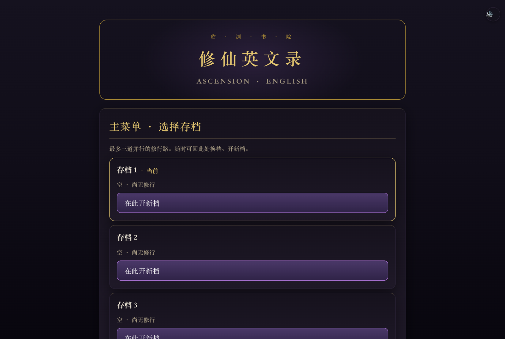
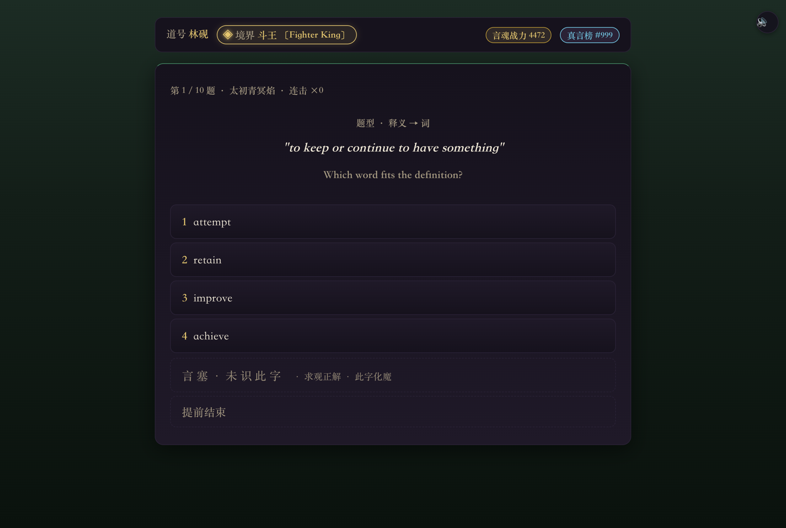
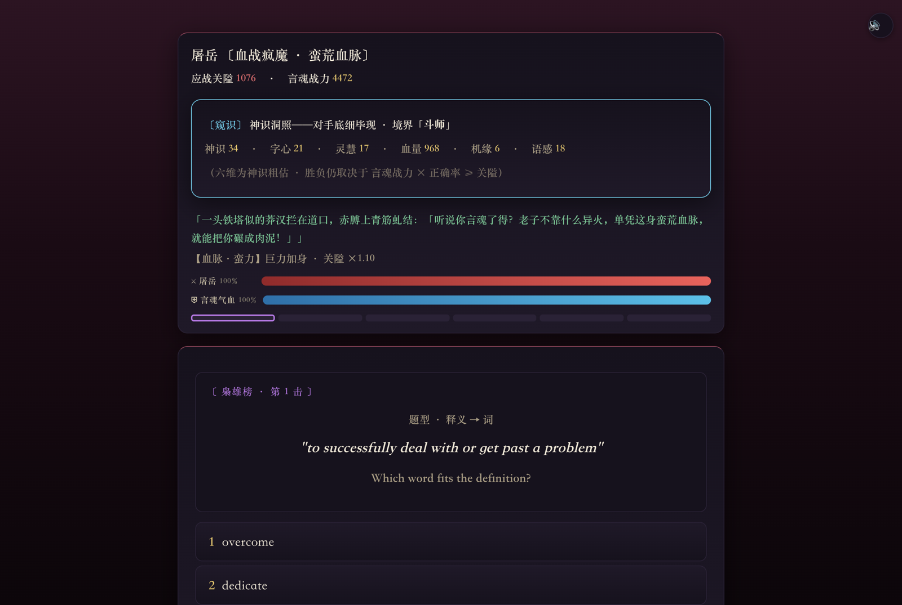
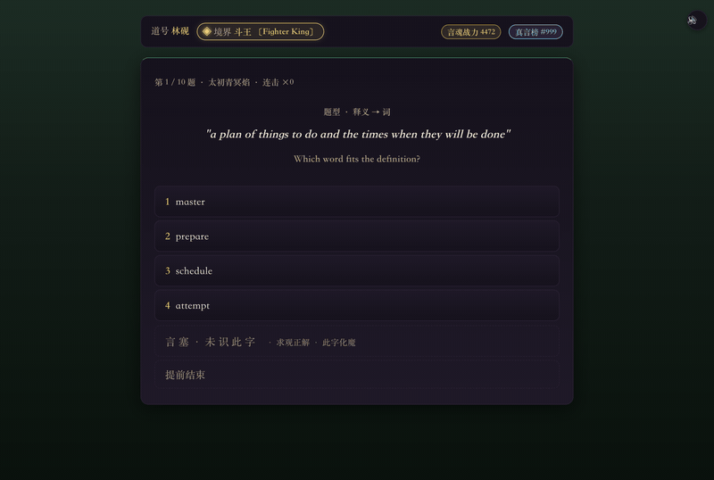
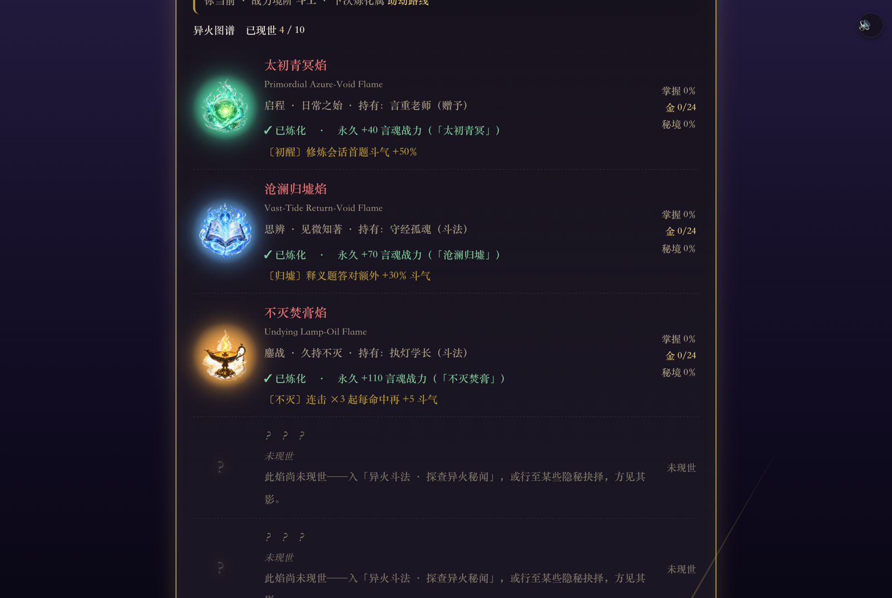
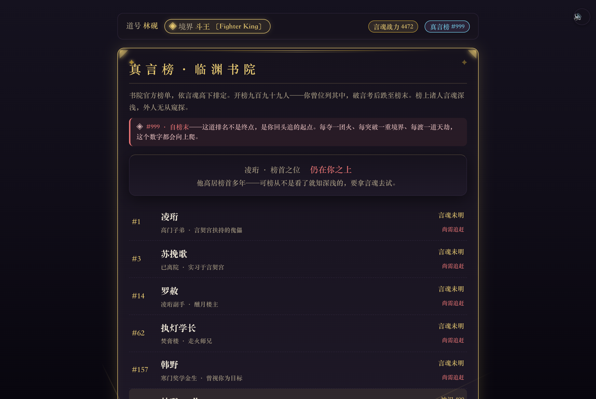
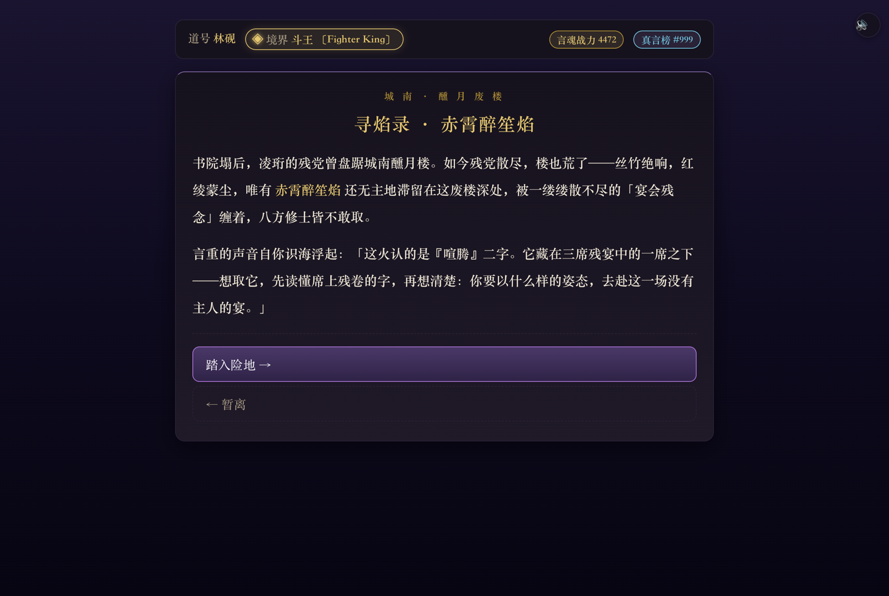
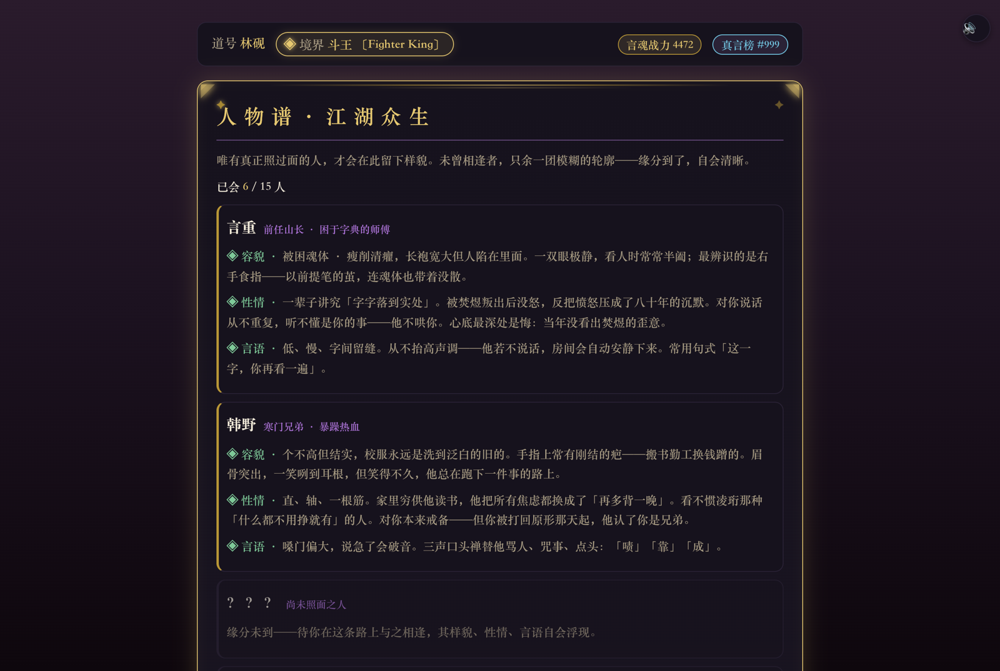

# 重生之我在仙界学英语

**一款边背单词边修仙的英语学习游戏。答对一个词，就是出一招；认得的词越多，境界越高。**

这是我做的第一版背单词修仙游戏。它和[《修仙英文录》](https://github.com/wjunlin293-tech/xiuxian-english)是同一个想法的两种做法：
《修仙英文录》更像一款安静的背词软件，这一版更像一部热血修仙小说，战斗、榜单、异火、奇遇更多，节奏更快。

**▶ [浏览器直接打开](https://wjunlin293-tech.github.io/reborn-immortal-english/)** —— 免安装、免注册，打开就能玩

> 两版都玩过的话，欢迎在 B 站评论区或 [Issues](https://github.com/wjunlin293-tech/reborn-immortal-english/issues) 说说更喜欢哪一版、为什么。
> 这会直接决定后面往哪个方向继续做。



<table>
<tr>
<td></td>
<td></td>
</tr>
</table>



## 怎么玩

1. 打开链接，选一个存档位开新档，起个道号
2. 选词书：**高中千词 / GRE 千词 / 牛津精选千词**（各 1000 词）
3. 进「修炼室」答题攒斗气，斗气满了就突破境界
4. 带着背下的词去闯关：枭雄榜、演武场、寻焰夺火、渡天劫

存档保存在你自己的浏览器里，不需要注册账号。换浏览器或清除网站数据会丢档。

## 值得一玩的地方

### 背词 = 出招


每一场战斗都是一轮单词题。答对就是出招打掉对手的血，答错会被反击。
答错后不会直接给答案，而是先给提示（词性、首字母、字母数），再给一次机会，
最后展示释义、音标、英文例句和中文翻译。单词可以点开听发音，还有听写题。

### 十团异火，一团一段主线



主线围绕**十团异火**展开，每团火都有自己的来历、持有者和一段"寻焰录"剧情。
夺下一团火要先答对与它相关的一组词，炼化后永久加战力，还附带一个专属被动，
比如某类题型额外加斗气、连击加成等。

### 七个各有绝活的对手


枭雄榜上有 7 位对手：蛮荒血脉、万剑门弃徒、蛊毒、金身护体、傀儡师、噬魂老鬼、狂剑客。
每人一种机制（血脉加伤、叠毒、护体减伤、连斩……），同样是答题，打法各不相同。
神识够高时可以先"窥探"对手的境界和属性，再决定打不打。

### 扮猪吃虎：藏锋与真言榜



书院有一张公开排名「真言榜」，你从第 999 名起步。
每次出战前可以选**韬光**（藏起修为让对手轻敌）、**平常**或**锋芒**（尽数外放，越阶取胜满堂哗然）。
实力是私密的，只有主动显露后，榜上排名才会变。

### 剧情分支与人物

<table>
<tr>
<td></td>
<td></td>
</tr>
</table>

- 34 章剧情，中后期分出**求真 / 复仇 / 入魔**三条世界线
- 「人物谱」记录一路遇到的 15 个角色：容貌、性情、说话方式，见过面才会解锁
- 道侣、心魔台、天劫渡劫等事件穿插在主线里

## 英语学习部分

| | |
|---|---|
| **词书** | 高中千词 · GRE 千词 · 牛津精选千词，共 3,000 词，每个词带英文释义、英文例句和中文翻译 |
| **题型** | 释义选词 · 中文选英文 · 例句填空 · 默写 · 听音听写 |
| **复习** | 间隔复习：记住的词隔几天再回来考，考过的词进入「神田」，之后定期"返青"复习 |
| **发音** | 调用浏览器自带的英语语音朗读，另显示音标 |
| **跨档** | 已掌握的词在新存档里不会重复出现 |

## 和《修仙英文录》的区别

| | 重生之我在仙界学英语（本仓库） | [修仙英文录](https://github.com/wjunlin293-tech/xiuxian-english) |
|---|---|---|
| **风格** | 热血爽文：异火、榜单、越阶挑战 | 慢节奏养成：按月推进，寿元有限 |
| **词量** | 3 本词书，3,000 词 | 8 本词书（中考到 GRE），去重后 9,245 词 |
| **节奏** | 想打就打，随时背随时战 | 每个月只能做一件事，时间是稀缺资源 |
| **技术** | 单个 HTML 文件 | 多模块 JavaScript 工程 |

## 文件说明

```
index.html      整个游戏（单文件，约 2.2MB）
img/            角色立绘、异火图、场景背景
music/          背景音乐
docs/images/    本页截图
```

纯 HTML / CSS / JavaScript，没有框架和依赖。

## 致谢与署名

游戏设计、剧情与词书整理：**Junlin (Jeff) Wu**
开发过程中使用了 AI 辅助编程。
